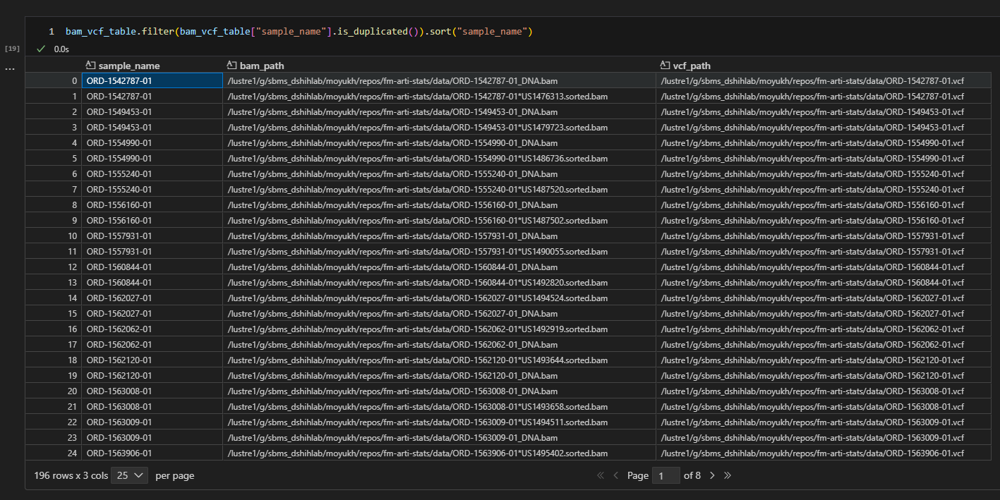

# FM-ARTI-STATS

Foundation Medicine Artifact Status

## Objective

Here we aim to analyze the extent of artifacts - FFPE, OxoG etc that may be present in foundation medicine dataset.

## Method

MOBSNVF used to determine the extent of FFPE and OxoG artifacts under the assumption that it has sufficient precision to identify artifacts are a True Positive

## Observations

Looking at the BAM headers, it is found that the alignment is done against hg19 reference. Therefore a UCSC hg19 reference was downloaded from the broad institute.

```
gs://gatk-legacy-bundles
```


## Replication

**Note:** All directory paths mentioned below are relative to the repository root.

1. The repository works under the assumption that the Foundation Medicine Data i.e BAM and VCFs placed in the `data` directory.

    A `link.sh` script is placed in this directory which can be modified to create a symbolic link of the data from the path where it resides.

2. Download the reference genome from the Broad Institute's legacy bundles at `gs://gatk-legacy-bundles`. 

Navigate to the `ref` directory and run:

```bash
bash get.sh
```

3. Navigate to the repository root and run `prepare.py`


```bash
python prepare.py
```

This will create batch scripts for FFPE and OxoG artifact filtering in the `ffpe-snvf` and `oxog-snvf` directories respectively based on the BAM and VCF data available in the `data` directory.

4. Navigate to `ffpe-snvf` directory and run `filter.sh`

```bash
    bash filter.sh
```

5. Navigate to the `oxog-snvf` directory and run `filter.sh`

```bash
    bash filter.sh
```


## Issues

It was seen that some VCFs have multiple BAMs. It was seen that the <sample_name>_DNA.bam is significantly smaller than the <sample_name>*US\<nnnnnnn>.sorted.bam. Sumedha was contacted for elaboration of the data. As of right now the larger bam is being used for analysis.




