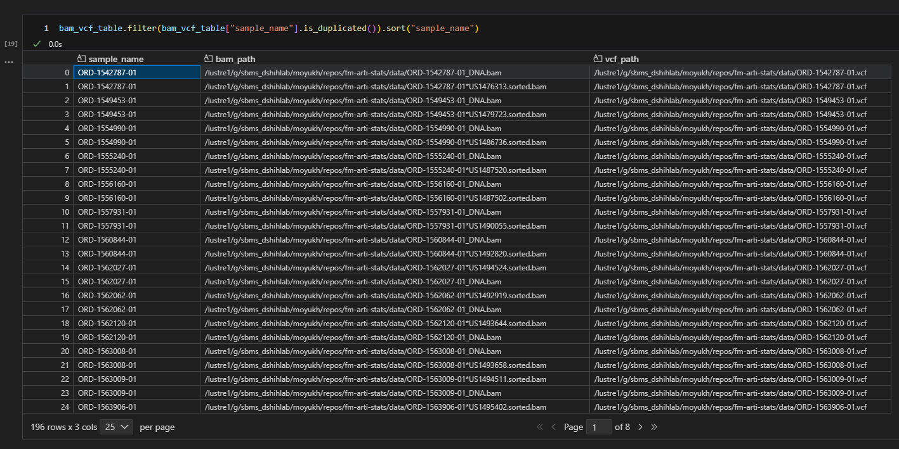
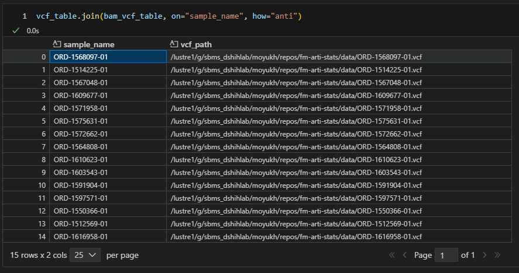

# FM-ARTI-STATS

Foundation Medicine Artifact Status

## Objective

Here we aim to analyze the extent of artifacts - FFPE, OxoG etc that may be present in foundation medicine dataset.

## Method

MOBSNVF is used to determine the extent of FFPE and OxoG artifacts under the assumption that it has sufficient precision i.e the artifacts identified are True Positive.

Analysis is performed using variants from both VCFs and XMLs for each sample with their corresponding BAM.

### XML 

SNVs are parsed from the XML into an SNV format before being passed on to each sample

### VCF

Raw VCFs are used as input into MOBSNVF

### Prediction

Raw results from MOBSNVF are stratified to predict true variants. 

The scores from MOBSNVF is first FDR adjusted and then these scores are used for making predictions based on a False Positive Cutoff threshold.

Two thresholds of False Positive Cutoff (FP-cut) is used in the analysis as of now:
- 5e-01
- 1e-08

### Artifact Proportion

These predictions are then used to calculate the proportion of artifacts in each sample and the overall statistics.


## Observations

1. The BAM headers states that read are aligned against the hg19 reference. Therefore the UCSC hg19 reference was downloaded from the broad institute.

```
gs://gatk-legacy-bundles
```

2. Some Samples have no associated BAMs. These samples are skipped.

3. Some Samples have no variants. These samples are also skipped.

4. Some sample have no variants after excluding VUS variants. These samples are skipped during analysis of the VUS set. 

5. The some variants in the XML are from the - strand. The reference and alternate alleles were substituted with their complementary nucleotides during parsing to SNV table to match up with the hg19 reference genome.


## Replication

**Note:** All directory paths mentioned below are relative to the repository root.

1. The repository works under the assumption that the Foundation Medicine Data i.e BAM and VCFs placed in the `data` directory.

    A `link.sh` script is placed in this directory which can be modified to create a symbolic link of the data from the path where it resides.

2. Download the reference genome from the Broad Institute's legacy bundles at `gs://gatk-legacy-bundles`. 

Navigate to the `ref` directory and run:

```bash
bash get.sh
```

3. Navigate to the repository root and run `prepare-vcf.py`.


```bash
python prepare-vcf.py
python prepare-xml.py
```

This will create batch scripts for FFPE and OxoG artifact filtering in the `vcf-ffpe-snvf` and `vcf-oxog-snvf` directories respectively based on the BAM and VCF data available in the `data` directory.

Samples without associated BAMs are saved to the `annot` directory.

4. Navigate to `vcf-ffpe-snvf` directory and run `filter.sh` to perform MOSBNVF filtering for FFPE artifacts on the variants present in the VCFs.

```bash
    bash filter.sh
```

5. Navigate to the `vcf-oxog-snvf` directory and run `filter.sh` to perform MOSBNVF filtering for OxoG artifacts on the variants present in the VCFs.

```bash
    bash filter.sh
```

6. Navigate to the repository root and run `prepare-xml.py`.

This does two things. First, The variant data parsed from the XML are saved in a tabular format in the `xml-snvs` directory. Each samples will have two associated files `<sample_name>.tsv` which is a table containing the SNVs with their respective annotations such as Allele Fraction, Gene, Protein Effect, Strand, Functional Effect etc. Along with a `<sample_name>.snv` which is a table containing just the SNVs from the XML. Indels in in the XML are ignored. This is done via regular expression pattern matching.

Second, a subset is made from MOBSNVF results for FFPE and OXOG filtering performed on the VCF, based on the SNVs parsed from the XML. This is because the XMLs contain a subset of the variants in the VCF. The results for FFPE and OXOG artifact filtering are saved to the `xml-ffpe-snvf` and the `xml-oxog-snvf` directory respectively.


7. Navigate to the repository root and run `predict.R` with specific values of fp-cut. From our testing fp.cut of 1e-08 was found to be a good cutoff giving a balanced tradeoff between precision and recall.

```
Rscript predict.R --fp.cut 0.5
Rscript predict.R --fp.cut 1e-08
```

This creates predictions based on the specified False Positive Cut threshold applied after FDR correcting the scores of MOBSNVF. The predictions are saved to the same directories as the MOBSNVF results mentioned in step 4-6.


8. Navigate to the `analysis` directory and run the `proportions.py`:

This calculates the proportion of artifacts in each sample and gives an overall summary. The table with the proportions are saved in the same directory. E.g. `ffpe_proportions_per_sample.xml.fp-cut_1e-08.tsv`, `oxog_proportions_per_sample.vcf.fp-cut_5e-01.tsv` etc.

9. From the `analysis` directory run `collect-artifacts.py`:

```
python collect-artifacts.py
```

This will create a table named `all_artifacts.mobsnvf.pred_fp-cut_<fp.cut>.tsv`. This includes all the FFPE and OXOG SNV artifacts detected in the VCFs and XMLs.

**To Do:** Add functionality to the python script for the FP-Cut to be passed in as an argument. As of right now an fp-cut of 1e-08 is used.

### Secondary analyses:

A notebook named `vcf_xml_concordance.ipynb` is present in the analysis directory to check the variants present in the VCF what are or are not present in the XML and vice versa. The analysis reveals that the XML variants are a true subset of the VCF variants. 


## Issues

It was seen that some VCFs have multiple BAMs. It was seen that the <sample_name>_DNA.bam is significantly smaller than the <sample_name>*US\<nnnnnnn>.sorted.bam. Sumedha was contacted for elaboration of the data. As of right now the larger bam is being used for analysis.



Some VCFs do not have associated BAMs



